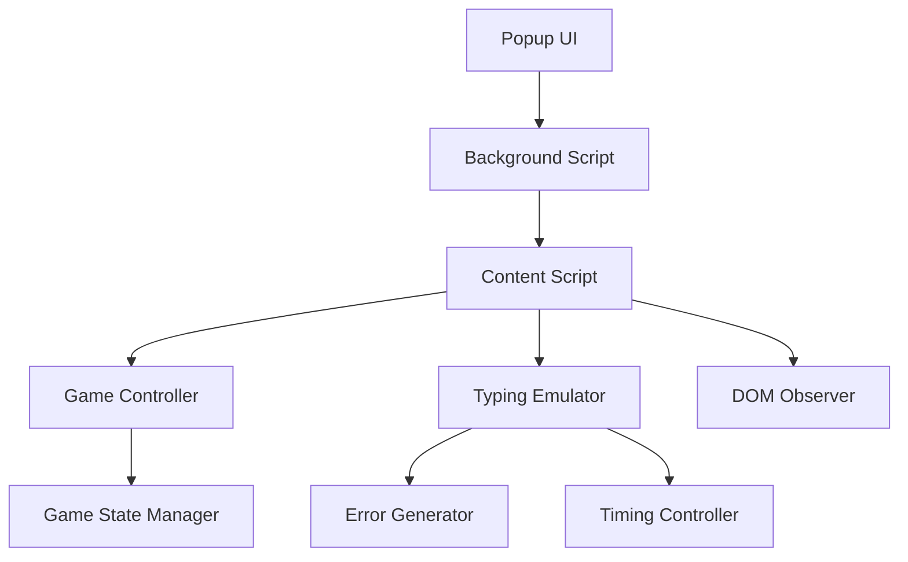

# Документ дизайна

## Обзор

Расширение Chrome для автоматизации игры в печать на сайте spritetype.irys.xyz состоит из нескольких ключевых компонентов: всплывающий интерфейс (popup), content script для взаимодействия с сайтом, background script для координации, и модули для эмуляции печати и управления игровым циклом.

## Архитектура

### Компоненты расширения Chrome



### Основные модули

1. **Popup Interface** - Пользовательский интерфейс расширения
2. **Background Script** - Координация между компонентами
3. **Content Script** - Взаимодействие с DOM сайта
4. **Game Controller** - Управление игровым циклом
5. **Typing Emulator** - Эмуляция естественной печати
6. **DOM Observer** - Отслеживание изменений на странице

## Компоненты и интерфейсы

### 1. Popup Interface (popup.html/js)

**Ответственность:**
- Отображение пользовательского интерфейса
- Сбор количества игр от пользователя
- Отображение статуса выполнения

**Интерфейс:**
```javascript
interface PopupController {
  showGameSettings(): void;
  showProgress(current: number, total: number): void;
  showError(message: string): void;
  onStartClick(callback: (settings: GameSettings) => void): void;
  onStopClick(callback: () => void): void;
}
```

### 2. Background Script (background.js)

**Ответственность:**
- Координация между popup и content script
- Управление состоянием расширения
- Обработка сообщений между компонентами

**Интерфейс:**
```javascript
interface BackgroundController {
  handlePopupMessage(message: Message): void;
  handleContentMessage(message: Message): void;
  sendToContent(message: Message): void;
  sendToPopup(message: Message): void;
}
```

### 3. Content Script (content.js)

**Ответственность:**
- Инициализация других модулей
- Координация работы на странице
- Обработка сообщений от background script

**Интерфейс:**
```javascript
interface ContentController {
  initialize(): void;
  startAutomation(settings: GameSettings): void;
  stopAutomation(): void;
  handleMessage(message: Message): void;
}
```

### 4. Game Controller (gameController.js)

**Ответственность:**
- Управление циклом игр
- Отслеживание состояния игры
- Координация между модулями

**Интерфейс:**
```javascript
interface GameController {
  startGameCycle(settings: GameSettings): void;
  stopGameCycle(): void;
  onGameStart(): void;
  onGameEnd(): void;
  getCurrentGameState(): GameState;
}

enum GameState {
  WAITING = 'waiting',
  TYPING = 'typing',
  FINISHED = 'finished',
  RESULTS = 'results'
}
```

### 5. Typing Emulator (typingEmulator.js)

**Ответственность:**
- Эмуляция естественной печати
- Генерация ошибок и их исправление
- Управление скоростью печати

**Интерфейс:**
```javascript
interface TypingEmulator {
  startTyping(text: string, settings: TypingSettings): void;
  stopTyping(): void;
  onTypingComplete(callback: () => void): void;
}

interface TypingSettings {
  baseSpeed: number;
  speedVariation: number;
  errorRate: number;
}
```

### 6. DOM Observer (domObserver.js)

**Ответственность:**
- Отслеживание изменений DOM
- Определение состояния игры
- Поиск элементов интерфейса

**Интерфейс:**
```javascript
interface DOMObserver {
  observeGameState(callback: (state: GameState) => void): void;
  observeWordsToType(callback: (words: string[]) => void): void;
  observeResultsPopup(callback: (popup: Element) => void): void;
  findTypingInput(): HTMLElement | null;
  findSubmitButton(): HTMLElement | null;
}
```

## Модели данных

### GameSettings
```javascript
interface GameSettings {
  gameCount: number;           // Количество игр для выполнения
}
```

### GameProgress
```javascript
interface GameProgress {
  currentGame: number;         // Текущая игра
  totalGames: number;          // Общее количество игр
  status: 'running' | 'paused' | 'completed' | 'error';
  currentGameState: GameState;
  lastError?: string;
}
```

### TypingState
```javascript
interface TypingState {
  currentWordIndex: number;    // Индекс текущего слова
  currentCharIndex: number;    // Индекс текущего символа
  wordsToType: string[];       // Массив слов для печати
  isTyping: boolean;           // Флаг активной печати
  hasError: boolean;           // Флаг наличия ошибки
}
```

## Обработка ошибок

### Стратегия обработки ошибок

1. **Ошибки DOM** - Если элементы не найдены, повторить попытку через 500мс
2. **Ошибки сети** - При проблемах с загрузкой страницы, показать ошибку пользователю
3. **Ошибки печати** - Если не удается ввести текст, остановить автоматизацию
4. **Таймауты** - Если игра не начинается в течение 10 секунд, показать ошибку

### Механизм восстановления

```javascript
interface ErrorHandler {
  handleDOMError(error: Error, retryCallback: () => void): void;
  handleTypingError(error: Error): void;
  handleNetworkError(error: Error): void;
  showUserError(message: string): void;
}
```

## Автоматические вариации

### Система случайных настроек

Для каждой новой игры система автоматически генерирует случайные вариации параметров печати:

1. **Скорость печати**
   - Базовый диапазон: 40-80 WPM
   - Случайная вариация: ±15 WPM от базового значения
   - Микровариации: ±20% для каждого символа

2. **Частота ошибок**
   - Базовая частота: 3-7% ошибок
   - Случайная вариация между играми
   - Зависит от сложности слов

3. **Естественные паузы**
   - Вариации интервалов между символами
   - Длинные паузы после знаков препинания
   - Короткие паузы между словами

## Детали реализации

### Алгоритм эмуляции печати

1. **Базовая скорость**: Случайное значение в заданном диапазоне WPM
2. **Вариации скорости**: ±20% от базовой скорости для каждого символа
3. **Генерация ошибок**: 
   - Вероятность ошибки на каждый символ
   - Замена на случайный соседний символ на клавиатуре
   - Исправление через backspace + правильный символ
4. **Естественные паузы**:
   - Длинные паузы после знаков препинания
   - Короткие паузы между словами
   - Случайные микропаузы

### Селекторы DOM элементов

```javascript
const SELECTORS = {
  TYPING_INPUT: 'input[type="text"]',
  WORDS_CONTAINER: '[class*="words"]',
  CURRENT_WORD: '[class*="current"]',
  RESULTS_POPUP: '[class*="results"]',
  SUBMIT_BUTTON: 'button:contains("Submit to Leaderboard")',
  TIMER: '[class*="timer"]',
  GAME_FINISHED: ':contains("Game finished")'
};
```

### Конфигурация по умолчанию

```javascript
const DEFAULT_CONFIG = {
  TYPING_SPEED: { min: 40, max: 80 }, // WPM
  ERROR_RATE: 0.05,                   // 5% ошибок
  GAME_TIMEOUT: 20000,                // 20 секунд на игру
  RETRY_ATTEMPTS: 3,                  // Попытки повтора
  RETRY_DELAY: 500,                   // Задержка между попытками
  PAUSE_BETWEEN_GAMES: 2000           // 2 секунды между играми
};
```